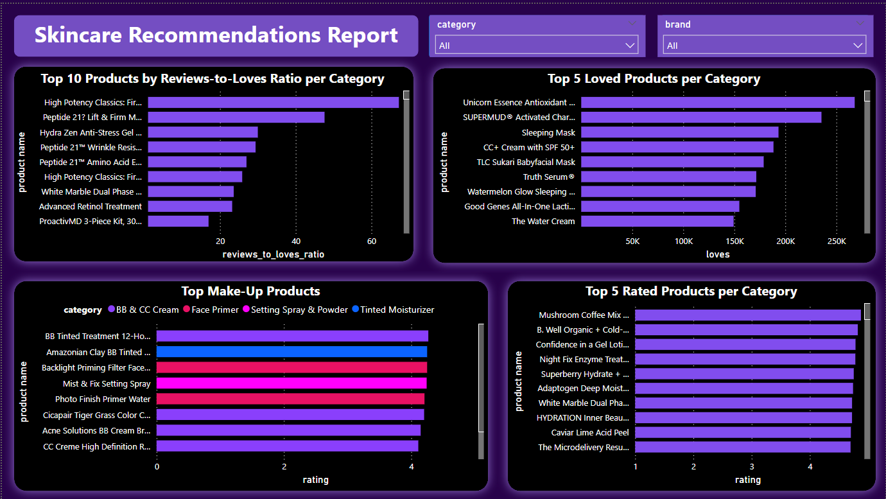

# Skincare Recommendation Analysis
## Project Overview
The Skincare Recommendation Analysis project provides data-driven insights and product recommendations within the skincare industry. By integrating data from five distinct datasets, this project aims to guide users in making informed decisions about skincare products based on different criteria such as product ratings, love-to-ratings ratio, and budget-friendly options. Through Python, SQL, and Power BI, this project analyzes, processes, and visualizes key metrics within the skincare sector.

## Technologies Used:
Python: Data cleaning and preprocessing
SQL: Customized queries for insights extraction
Power BI: Data visualization and interactive dashboards

# Implementation:
The project integrates five distinct datasets into a single CSV file called product_df. These datasets include information such as brand, product name, category, review score, price, number of reviews, number of loves, and size. The datasets were merged to provide a comprehensive analysis of skincare products. They were also preprocessed to ensure consistency and handle missing or redundant data using Python.

## Data Cleaning & Preprocessing
The following steps were taken to clean and preprocess the data:
Removed duplicates  
Handled missing values
Standardized the formatting of values

## SQL Queries
Custom SQL queries were written to extract various insights from the data for various cases. Some key queries include:

- Top 10 products by category based on the loves-to-ratings ratio
- Top 10 budget-friendly selections per category
- Top 5 rated products per category
- Top 5 loved products per category
- Top 5 ranked brands, and more

## Data Visualization
### Power BI Visuals
To bring insight to life, I executed the SQL queries in Power BI, transforming the data into interactive visualizations. These visuals provide an evidence based perspective on the skincare sector, guiding users toward top products tailored to specific criteria, budget-friendly options, popular brands, and other essential metrics.

## Conclusion
This project not only informs users but also bridges my passion for skincare with my technical skills in data analysis and visualization, enhancing my existing skills and adding Power BI as a new skill I learned independently for data visualization and dashboard creation.

[Datasets: ](https://www.kaggle.com/datasets/thedevastator/skincare-products-that-perform-the-best-at-sepho)

