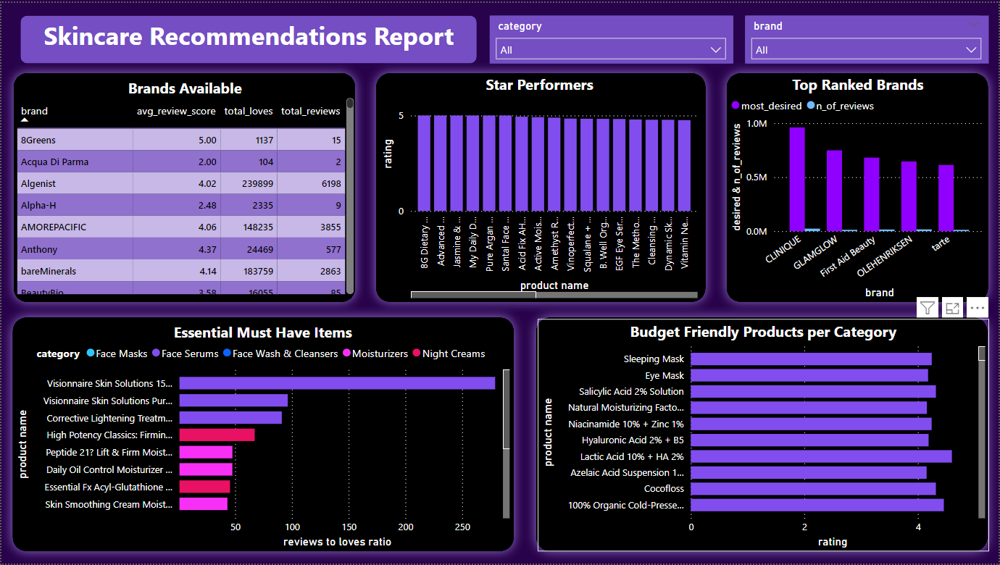

# Skincare Recommendation Analysis
As a dedicated skincare enthusiast, I created the Skincare Recommendation Analysis project to provide data-driven insights and product recommendations in the skincare industry.
The project integrates data from five distinct datasets and utilizes Python for data cleaning and preprocessing to ensure high-quality data. It leverages SQL customized queries to extract insights across various cases, such as:
- Top 10 products by category based on the loves-to-ratings ratio
- Top 10 budget-friendly selections per category
- Top 5 rated products per category
- Top 5 loved products per category
- Top 5 ranked brands, and more

## Data Analysis & Visualization
SQL queries were executed in Power BI to transform the data into interactive visualizations. These visuals provide a evidence based perspective on the skincare sector, offering users insights into the top products, budget-friendly options, leading brands, and other key metrics within the industry.

